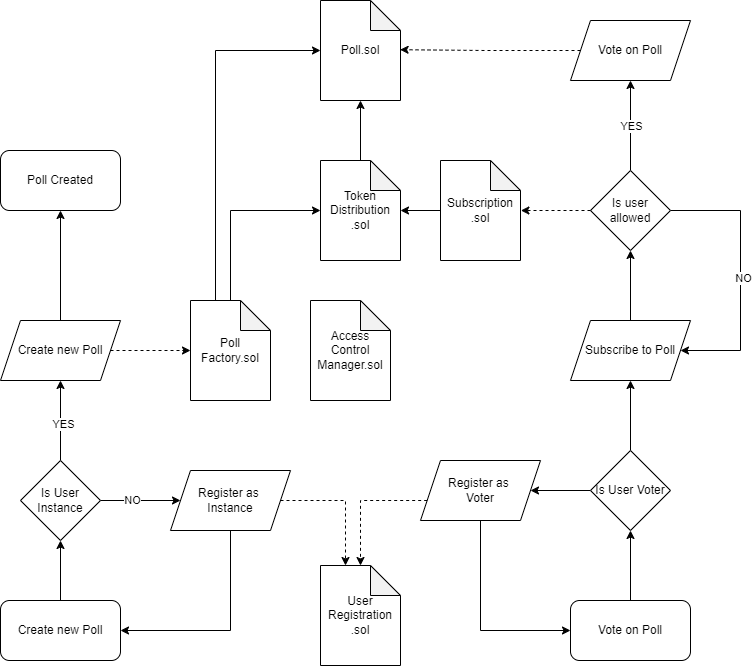

# Blockchain-Based Polling System

This repository contains my **final project for school**, a blockchain-based polling system deployed on the Ethereum blockchain. This project aims to revolutionize the traditional political system by replacing voting on political groups with direct voting on poll options. This eliminates the need for political parties, making politicians directly accountable for implementing the outcomes of these polls.

## 📜 Why This Exists

This project serves as a **proof of concept** to demonstrate how blockchain technology can be used to create a transparent, secure, and tamper-proof polling system. By leveraging blockchain, we ensure:

- Decentralized and tamper-proof voting.
- Transparency in poll creation and results.
- Accountability of politicians to fulfill polling outcomes.

**Note:** This project is a **proof of concept** and is limited to basic functionalities. It is not production-ready.

## 💡 How It Works with Blockchain

This system uses Ethereum smart contracts to handle the following:

1. **Poll Management**: Each poll is represented as a smart contract, allowing participants to vote securely.
2. **Token Distribution**: Users are allocated tokens (NFTs) specific to a poll, which they can use to cast votes.
3. **Access Control**: Role-based access ensures that only authorized entities can perform specific actions (e.g., creating polls, subscribing users).

Each poll is tied to a smart contract that:
- Tracks voting options and counts votes.
- Finalizes poll results after the deadline.
- Stores all data on the blockchain for immutability and transparency.

## 🔍 Smart Contracts Overview

Here’s a brief explanation of each contract and its responsibility:

1. **AccessControlManager.sol**  
    Handles role-based access control. Ensures that only authorized users and instances can interact with specific functions in the system.

2. **Poll.sol**  
    Represents an individual poll. Manages voting options, user votes, and finalization of poll results.

3. **PollFactory.sol**  
    Allows the creation of new polls. Each poll is deployed as a unique instance using this contract.

4. **UserRegistration.sol**  
    Manages user and instance registration, ensuring participants meet eligibility criteria.

5. **TokenDistribution.sol**  
    Handles the allocation and transfer of NFTs (tokens) for voting. Tracks token balances for each user.

6. **Subscription.sol**  
    Verifies user eligibility and handles the subscription process for polls, ensuring users have the necessary tokens to participate.



## 🛠️ How to Run the Project Locally

Follow these steps to set up and run the project:

### Prerequisites
- Node.js installed.
- npm package manager.
- Hardhat (installed via npm).

### Steps

1. **Open Three Terminal Windows**:
   - One for the Hardhat network.
   - One for deployment scripts.
   - One for the frontend.

2. **Terminal 1**: Start Hardhat Network
   ```bash
    npx hardhat clean
    npx hardhat compile
    npx hardhat test
    npx hardhat export-abi
    npx hardhat node
   ```

3. **Terminal 2**: Deploy Contracts
   ```bash
    npx hardhat run scripts/deployAndAssignRoles.js --network localhost
   ```

4. **Terminal 3**: Start Hardhat Network
   ```bash
    cd frontend
    npm install
    npm run dev
   ```

### Setting Up an Alchemy for Sepolia Testnet

To connect to the Sepolia testnet, follow these steps to obtain an **RPC URL** from Alchemy:

1. **Create an Alchemy Account**  
   - Sign up at [alchemy.com](https://www.alchemy.com/) and log in.

2. **Create a New Project**  
   - In the Alchemy Dashboard, create a new project, select **Ethereum**, and choose the **Sepolia Testnet**.

3. **Get the RPC URL**  
   - Navigate to your project, locate the **HTTP URL** under the API section.  
   - The URL will look like this:  
     `https://eth-sepolia.g.alchemy.com/v2/<ALCHEMY_API_KEY>`

4. **Add to `.env` File**  
   - Copy the RPC URL and paste it into your `.env` file:  
     `VITE_ALCHEMY_API_URL=https://eth-sepolia.g.alchemy.com/v2/<ALCHEMY_API_KEY>`

5. **Secure Your Key**  
   - Keep your `.env` file private and avoid sharing your API key.

6. **Get Sepolia ETH from a Faucet**  
    To interact with the Sepolia testnet, you'll need test ETH:
    - Visit the [Sepolia Faucet](https://www.alchemy.com/faucets/ethereum-sepolia) or search for a trusted Sepolia faucet.
    - Paste your wallet address to receive test ETH.
    - Use this ETH for deploying and testing smart contracts.

You’re now ready to connect your project to the Sepolia testnet using Alchemy!

### Configure MetaMask for Testing

To interact with the blockchain, you need to configure your MetaMask wallet to connect to both your **localhost Hardhat network** and the **Sepolia testnet**. Here’s how:


#### **1. Add the Localhost Hardhat Network**
The Hardhat network runs on your local machine for development and testing. Follow these steps:

1. Open MetaMask and click on the network dropdown at the top.
2. Select **Add a network** (or **Add a network manually**).
3. Enter the following details for the localhost Hardhat network:
    - Network Name: Hardhat Localhost 
    - RPC URL: http://127.0.0.1:8545 
    - Chain ID: 31337 
    - Currency Symbol: ETH
4. Click **Save**.  
Your MetaMask wallet is now configured to connect to your local Hardhat network.

#### **2. Add the Sepolia Testnet**
The Sepolia testnet is used for testing in a real-world-like environment. Follow these steps:

1. Open MetaMask and click on the network dropdown at the top left.
2. Select **Show terst networks**.
3. Connect

Your MetaMask wallet is now configured to connect to the Sepolia testnet.

#### **3. Switch Between Networks**
- To switch networks, open MetaMask, click the network dropdown, and select either **Hardhat Localhost** or **Sepolia Testnet**.
- Ensure the correct network is selected before interacting with your smart contracts.

---

You’re now ready to test on both your local Hardhat network and the Sepolia testnet!

## 🚀 Features

- **Poll Creation**: Instances can create polls with customizable options.
- **User Registration**: Ensures participants are eligible to vote.
- **Secure Voting**: Users vote using NFTs allocated specifically for the poll.
- **Poll Results**: Transparent and immutable poll results stored on the blockchain.


## ⚠️ Limitations

- **Proof of Concept**: This system is a basic prototype and is not designed for production use.
- **No Real-World Deployment**: Currently, it runs only on a local blockchain (Hardhat).

## 🤝 Contribution
Feel free to fork this repository and suggest improvements or add new features. This is a learning project, and contributions are welcome!

## 📜 License
This project is licensed under the MIT License.